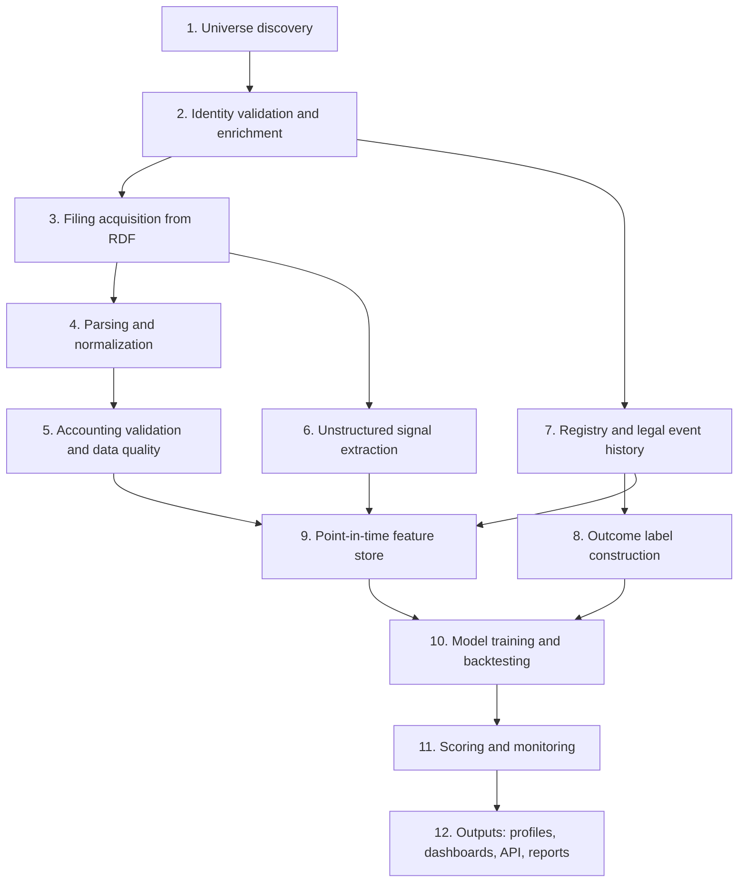

# Polish Corporate Distress Radar

## Summary

Polish Corporate Distress Radar is an end-to-end data platform that estimates the probability that a Polish company will enter bankruptcy, restructuring, or liquidation within the next 12 and 24 months.

It builds a point-in-time warehouse from the statutory financial statements that KRS-registered companies file in the Repozytorium Dokumentów Finansowych (RDF). It enriches those statements with registry history (KRS, GUS REGON), unstructured signals from auditor reports and notes, and filing-behavior patterns. It labels outcomes using the Krajowy Rejestr Zadłużonych (KRZ) and the historical Monitor Sądowy i Gospodarczy (MSiG). The platform then trains, backtests, and serves distress models calibrated to Polish accounting law (Ustawa o rachunkowości) instead of US-centric assumptions.

The first release targets a deliberately narrow slice:

| Dimension | v1 scope |
|---|---|
| Sector | Construction (PKD section F) |
| Legal form | Spółka z ograniczoną odpowiedzialnością |
| Size | Small and medium entities under the accounting law's thresholds |
| History | At least 3 consecutive filed financial years |
| Accounting framework | Polish GAAP (UoR) filers using Ministry of Finance XML structures |

The platform is designed so that expanding to new sectors, legal forms, or size classes is a configuration change, not a rebuild.

---

## End-to-End Flow

Every stage is idempotent, versioned, and re-runnable on its own. Every number shown to an end user can be traced back to a specific source document, XML element, and ingestion run.

### Stage crosswalk

The numbered stages below are the functional view. `AGENT_SPEC.md` and the code use letter-coded stage groups. They map as follows, and this table is the authoritative correspondence between the two schemes:

| This document | Spec stage | Package location |
|---|---|---|
| 1. Universe discovery | A1 | `src/distress_radar/acquisition/` |
| 2. Identity validation and enrichment | A2 | `src/distress_radar/acquisition/` |
| 3. Filing acquisition | A3, B | `src/distress_radar/acquisition/` |
| 4. Parsing and normalization | C | `src/distress_radar/parsing/` |
| 5. Accounting validation and data quality | E | `src/distress_radar/parsing/accounting_identities.py` (wired in `dagster_defs/checks/`), `transform/` |
| 6. Unstructured signal extraction | G | `src/distress_radar/extraction/` |
| 7. Registry and legal event history | A4, C | `src/distress_radar/acquisition/` (sources), `src/distress_radar/parsing/legal_events.py` |
| 8. Outcome label construction | F | `transform/`, `src/distress_radar/labels.py` |
| 9. Point-in-time feature store | H | `src/distress_radar/features/` |
| 10. Model training and backtesting | I | `src/distress_radar/models/` |
| 11. Scoring and monitoring | I, L | `src/distress_radar/models/`, `dagster_defs/` |
| 12. Outputs | J, K | `src/distress_radar/api/`, `app/`, `site/`, `report/` |

Spec stage D (exploration, `notebooks/`) supports the work but produces no production asset, so it has no numbered stage here.

### Build plans

Stage-by-stage implementation plans live in `docs/plans/`, one numbered `.md` file per requested build step, never overwritten — the highest-numbered file describes the current step.

---

## Stage 1: Universe Discovery

**Goal:** produce a candidate list of KRS numbers that plausibly match the target segment.

**What happens:**

- The pipeline accepts a declarative segment spec, for example `sector: PKD F`, `legal_form: sp. z o.o.`, `size: [small, medium]`, `min_history_years: 3`.
- Candidates are gathered from permitted discovery sources, such as commercial registry aggregators used within their terms of service, and new-registration feeds.
- Each candidate is stored with its discovery source and discovery timestamp, so the provenance of the universe itself is auditable.
- GUS aggregate statistics (entity counts by PKD section and employment band) serve as a coverage sanity check. If the discovered universe is wildly smaller or skewed compared to official counts, the run is flagged.

**Output:** `universe_candidates`, a list of KRS numbers with source lineage and a coverage report.

---

## Stage 2: Identity Validation and Enrichment

**Goal:** confirm that each candidate really belongs in the segment, and resolve its identifiers.

**What happens:**

- Each candidate is checked against the GUS REGON (BIR1) API and official KRS extracts to confirm legal form, active or deregistered status, NIP, REGON, and registered PKD codes.
- The segment rule for PKD is explicit and configurable: match on the predominant activity code only, or on any registered code.
- PKD codes are mapped across classification versions. PKD 2025 replaced PKD 2007, so historical and current codes are reconciled through a crosswalk table to keep sector membership consistent over time.
- Conflicts between sources (for example, different PKD codes in REGON and KRS) are logged, resolved by a documented precedence rule, and surfaced in a reconciliation report.
- Size class is **not** taken from registry labels. Registries do not carry the accounting-law size classification, so it is computed in Stage 5 from the filed statements themselves.

**Output:** `entity_master`, one row per validated company with all identifiers, and `entity_reconciliation_log`.

---

## Stage 3: Filing Acquisition

**Goal:** retrieve every available financial filing for each validated company.

**What happens:**

- For each KRS number, the pipeline queries RDF one entity at a time, with polite request pacing that respects the portal's terms of use.
- It downloads the filing index and the documents: financial statements (XML or other formats), auditor reports, management reports, resolutions approving the statements and allocating profit or covering losses, and any corrections.
- Every document is stored immutably in raw form, with a content hash, the RDF submission date, and the acquisition timestamp.
- Re-runs are incremental. Already-acquired documents are skipped by hash, and new submissions or corrections are picked up automatically.
- The **RDF submission date** is recorded as the document's public availability date. This date drives all point-in-time logic downstream.

**Output:** `raw_documents` (immutable object store) and `filing_index`.

---

## Stage 4: Parsing and Normalization

**Goal:** turn heterogeneous filings into one canonical financial model.

**What happens:**

- The parser detects each XML file's structure and version, covering the full-form statements, the simplified statements available to small entities, and the new generation of structures that applies to financial years beginning on or after 1 January 2025 (ADR 0005).
- Each structure-version is mapped to a **canonical chart of line items** through versioned, tested mapping tables.
- The parser handles known reporting variations:
  - Amounts reported in złoty versus thousands of złoty, normalized to one unit.
  - Income statement in the comparative variant (costs by nature) versus the calculation variant (costs by function), with common-denominator metrics derived where a direct mapping is impossible.
  - Cash flow statements prepared with the direct or indirect method.
  - Current-year and prior-year columns, both captured, so the platform can detect when a company's comparative figures differ from what it originally reported.
- Documents that are not machine-readable XML (for example, scanned or PDF attachments) are routed to an extraction queue rather than silently dropped.

**Output:** `financial_statements_canonical` (long format: entity, fiscal period, line item, value, source element, source document) and `restatement_events`.

---

## Stage 5: Accounting Validation and Data Quality

**Goal:** guarantee that the warehouse contains financially coherent data, and quantify what it doesn't.

**What happens:**

- **Accounting identity checks:** total assets equal total equity and liabilities. Subtotals equal the sum of their components. The net profit on the income statement matches the balance sheet profit line. Cash movement reconciles to the change in the cash balance.
- **Plausibility checks:** sign errors, implausible jumps between years, and suspected unit mistakes (values off by a factor of 1,000).
- **Size classification:** the accounting-law size class is computed for each fiscal year from the balance sheet total, revenue, and average employment, using the multi-year rules the law requires. Threshold values are stored as **versioned configuration**, because statutory thresholds change over time.
- Each record receives a quality grade. Failing records are quarantined, not deleted, with the failure reason stored.
- A data quality dashboard shows pass rates by structure version, fiscal year, and check type.

**Output:** `financial_statements_canonical` with `quality_grade` populated, `entity_size_class_history`, and `dq_mart`.

---

## Stage 6: Unstructured Signal Extraction

**Goal:** capture risk signals that live in Polish-language text, not in numbers.

**What happens:**

- **Auditor reports** are parsed for the opinion type (unqualified, qualified, adverse, disclaimer), a material uncertainty related to going concern, and emphasis-of-matter paragraphs.
- **Notes and management reports** are scanned for going-concern discussion, covenant breaches, loss of key customers or contracts, litigation, and events after the balance sheet date.
- **Resolutions** are checked for how losses were covered and whether shareholders voted on the company's continued existence.
- Each extracted signal stores the source document, the page or section, the supporting text span, the extraction method, and a confidence score.
- A hand-labeled evaluation set measures extraction precision and recall. Extraction models are only promoted if they beat the previous version on this set.

**Output:** `text_signals`, with full evidence lineage for every extracted signal.

---

## Stage 7: Registry and Legal Event History

**Goal:** reconstruct each company's legal timeline.

**What happens:**

- Full KRS extracts are parsed into dated events: management board changes, share capital changes, registered office moves, PKD changes, the opening of liquidation, and deregistration.
- KRZ is checked for bankruptcy and restructuring proceedings, covering the period from its launch at the end of 2021 (not built yet: it sits behind a WAF, ADR 0011).
- MSiG notices are searched by KRS and reduced to person-free records, adding petition-stage orders, the COVID-era simplified restructuring and earlier publication dates; the KRS extract itself covers both eras (ADR 0011).
- Events from different sources describing the same proceeding are deduplicated into one canonical event.
- Natural persons are excluded from ingestion entirely. Only legal entities are stored.

**Output:** `legal_events`, a bitemporal timeline recording both when each event occurred and when it became public.

---

## Stage 8: Outcome Label Construction

**Goal:** define what "distress" means, precisely and reproducibly.

**What happens:**

- Events are mapped to a documented outcome taxonomy:

| Outcome class | Examples |
|---|---|
| Bankruptcy | Petition filed, bankruptcy declared, petition dismissed for insufficient assets |
| Restructuring | Arrangement approval, accelerated arrangement, arrangement proceedings, remedial proceedings, COVID-era simplified restructuring |
| Liquidation | Voluntary liquidation opened |
| Silent exit | Filings stop and the company is later deregistered |

- Labels are generated for 12-month and 24-month horizons from each prediction date.
- Companies that are still alive but haven't reached the end of a horizon are treated as **censored**, not as survivors.
- Regime flags mark periods where the legal environment changed the meaning of an event, most importantly the 2020–2021 simplified restructuring spike.
- Every label version is frozen with a hash, so any model can be tied to the exact label set it was trained on.

**Output:** `outcome_labels` (entity, prediction date, horizon, outcome class, censoring flag, label version).

---

## Stage 9: Point-in-Time Feature Store

**Goal:** give models exactly what a real observer could have known on a given date, and nothing more.

**What happens:**

- Features are computed **as of a prediction date**, using only documents whose public availability date is on or before that date.
- Feature families:
  - **Financial ratios:** liquidity, leverage, profitability, efficiency, working capital structure, and interest coverage, plus multi-year trends and volatility.
  - **Construction-specific metrics:** receivables and payables turnover, contract-related balances, and backlog proxies where available.
  - **Legal tripwires:** whether losses exceed the Commercial Companies Code threshold that forces shareholders to vote on the company's continued existence (Art. 233 KSH for sp. z o.o.), negative equity, and loss coverage history.
  - **Filing behavior:** days between fiscal year-end and filing, missing years, late filings, corrections, and change of auditor.
  - **Text signals** from Stage 6.
  - **Registry dynamics** from Stage 7, such as frequent board turnover or office moves.
  - **Macro and sector context:** NBP reference rate, sector-level financial aggregates, and regional indicators.
- Automated leakage tests fail the build if any feature references data with an availability date later than the prediction date.

**Output:** `feature_store` (entity, as-of date, feature vector, feature set version).

---

## Stage 10: Model Training and Backtesting

**Goal:** produce models that are accurate, calibrated, explainable, and honestly evaluated.

**What happens:**

- Three generations of models are trained and compared on identical data:
  1. **Baselines:** Altman Z-score variants.
  2. **Polish classics:** discriminant models from Polish academic literature.
  3. **Modern models:** regularized logistic regression, gradient boosting, and discrete-time survival models that handle censoring.
- Evaluation is strictly **out-of-time**: train on earlier years, test on later years, rolling forward. Test windows deliberately include known stress periods: COVID, the 2022 rate hiking cycle, and the energy price shock.
- Reported metrics: discrimination (AUC, precision at top deciles), calibration (Brier score, reliability curves), stability across years, and performance per outcome class and sub-sector.
- Every model run is registered with its code version, feature set version, label version, and hyperparameters. A model can only be promoted if it beats the current champion on the agreed metrics.

**Output:** registered model versions in MLflow and an auto-generated backtest report.

---

## Stage 11: Scoring and Monitoring

**Goal:** keep scores current as the world changes.

**What happens:**

- Scoring runs on a schedule and on triggers:
  - **Daily:** check KRZ and KRS for new events affecting monitored companies.
  - **Weekly:** check RDF for new or corrected filings.
  - **Filing season surge:** most companies with calendar-year books must approve statements within six months and file shortly after, so early summer brings a large wave of new filings. The pipeline scales acquisition and parsing for this window.
- Each new score is stored alongside its explanation: the top contributing features and how they moved since the previous score.
- **Alerts** fire when a score crosses a configurable threshold, jumps sharply, a legal tripwire is triggered, a going-concern warning appears, or a company misses its expected filing window.
- **Model monitoring** tracks feature drift, score distribution shifts, and realized outcomes against predicted probabilities, raising a retraining recommendation when calibration degrades.

**Output:** `scores_history`, `alerts`, and `monitoring_reports`.

---

## Stage 12: Outputs

### Company risk profile

For any company in scope:

- Current 12-month and 24-month distress probabilities with confidence ranges.
- A score history chart annotated with filings, legal events, and alerts.
- Plain-language explanation of the main risk drivers.
- Normalized multi-year financial statements, with each figure linked to its source document.
- Extracted text signals with their supporting evidence.
- Peer comparison against companies of similar sub-sector, size, and region.

### Sector and regional dashboards

- Distress probability distribution across the construction sector over time.
- Heatmaps by voivodeship and sub-sector (building construction, civil engineering, specialized works).
- Realized outcomes against predicted rates per period.
- Leading indicators, such as the share of companies breaching legal tripwires or filing late.

### Watchlists

- Users build watchlists of companies and receive alerts according to their own thresholds.

### API

- Endpoints for company scores, explanations, financial history, events, and sector aggregates, each response carrying data version metadata.

### Methodology and research report

- Auto-generated, versioned report covering data coverage, data quality, label definitions, model comparison, backtest results, and known limitations.

---

## Walkthrough: One Company Through the Pipeline

1. A construction sp. z o.o. appears in the discovery results under PKD section F.
2. Validation confirms its legal form and active status, resolves its NIP and REGON, and maps its PKD 2007 history to PKD 2025.
3. RDF acquisition pulls five years of statements, auditor reports, and resolutions.
4. The parser detects that two early years were filed in the simplified small-entity structure and three later years in the full structure, and maps all five into the canonical model.
5. Validation computes the size class per year and confirms it stayed within scope. One year is flagged because its amounts appear to be in thousands despite being declared in złoty. The fix is applied and logged.
6. Text extraction finds that the latest auditor report contains a material going-concern uncertainty.
7. The legal timeline shows two management board changes in 18 months.
8. On the next scoring run, the feature store detects losses above the Art. 233 KSH threshold, a filing submitted well past the usual window, and the going-concern flag.
9. The company's 12-month distress probability jumps, an alert fires, and the explanation lists those three drivers.
10. Months later, KRZ records a restructuring proceeding. The monitoring layer logs it as a correctly anticipated outcome and feeds it into the calibration report.

---

## Guardrails and Compliance

- **Access:** every source is accessed within its terms of use, with request pacing and caching to minimize load on public portals.
- **Personal data:** natural persons are excluded. Names of board members are not needed for modeling and are pseudonymized wherever registry dynamics are derived from them.
- **Publication:** the public demo shows aggregated or pseudonymized results. Named company-level risk scores are available only in a local deployment, with a clear disclaimer that scores are statistical estimates, not statements of fact about any company.
- **Reproducibility:** any published figure can be regenerated from pinned code, data snapshots, label versions, and model versions.

---

## Definition of Done

The platform is complete when:

- [ ] A segment spec produces a validated entity universe with a coverage report.
- [ ] All supported XML structure versions parse into the canonical model with tested mappings.
- [ ] Accounting identity checks run on every record, with published pass rates.
- [ ] Text signals are extracted with measured precision and recall against a labeled set.
- [ ] Outcome labels cover both the MSiG era and the KRZ era, with censoring handled.
- [ ] Leakage tests guarantee point-in-time correctness for every feature.
- [ ] All three model generations are compared in an out-of-time backtest report.
- [ ] Scheduled scoring, alerting, and drift monitoring run without manual intervention.
- [ ] Company profiles, sector dashboards, and the API are live, with full source lineage.
- [ ] Every stage can be re-run independently and reproduces identical outputs from the same inputs.
