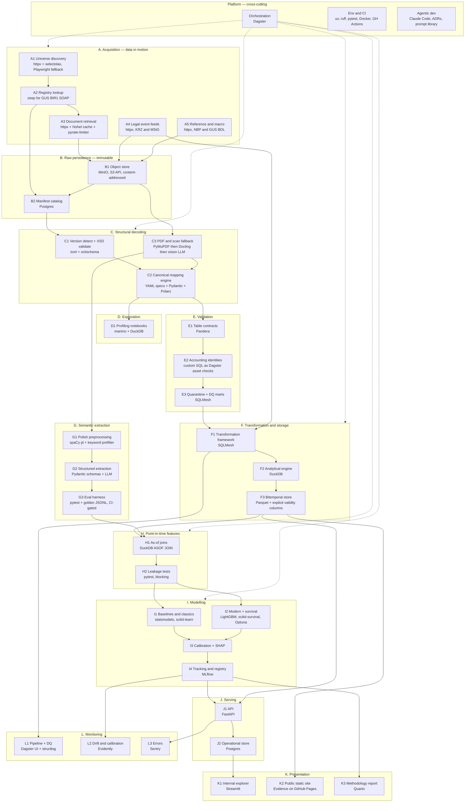

# Polish Corporate Distress Radar — Technical Architecture

Companion to `PROJECT_OVERVIEW.md`. That document describes *what* the platform does. This one describes *how it is built*: the project decomposed by type of data operation, with tool options and a recommended pick for each.

---

## 1. Technical Scope Summary

### 1.1 Size the problem before choosing tools

The single most important architectural fact is the data volume. Estimate it honestly for the v1 scope:

| Dataset | Estimate | Order of magnitude |
|---|---|---|
| Entities in universe | ~3,000 construction sp. z o.o. | 10³ |
| Raw documents acquired | 3,000 × 8 years × ~3 docs | 10⁵ files |
| Canonical financial line items | 3,000 × 8 years × ~400 items | ~10⁷ rows |
| Legal events | 3,000 × ~15 events | 10⁴ rows |
| Text signals | 3,000 × 8 years × ~10 signals | 10⁵ rows |
| Feature store | 3,000 × 96 monthly as-of dates | ~3 × 10⁵ rows × ~200 cols |

Ten million rows of line items. A few gigabytes of Parquet at most. This fits in RAM on a laptop.

**This must drive every tool decision.** Reaching for Spark, Kafka, or a cloud warehouse here would be resume theater, and any experienced reviewer reads it as a signal that the candidate cannot size a problem. The credible move is to build a correctly-sized stack and spend the entire complexity budget on the things that are genuinely hard.

### 1.2 Where the difficulty actually lives

| Source of complexity | Why it is hard |
|---|---|
| **Schema heterogeneity** | 10+ Ministry of Finance XML structure versions across micro/small/full forms and the generation for fiscal years from 2025 (ADR 0005), each needing versioned, tested mappings to one canonical model |
| **Bitemporality** | Every fact has a fiscal period *and* a public availability date. Getting point-in-time correctness right, and proving it with automated leakage tests, is the core engineering claim |
| **Statutory logic as code** | Accounting-law size thresholds, KSH Art. 233 tripwires, and restructuring procedure taxonomies all change over time and must be versioned configuration, not constants |
| **Two reporting variants** | Comparative vs. calculation income statement, direct vs. indirect cash flow — there is no lossless single mapping, so the canonical model needs deliberate design |
| **Unstructured Polish text** | Going-concern paragraphs and covenant breaches live in PDF prose in a heavily inflected language, requiring an extraction pipeline with a measured eval set |
| **Label ambiguity** | Bankruptcy vs. restructuring vs. liquidation vs. silent exit, across a KRZ/MSiG source break and a COVID-era regime change, with censoring |
| **Reproducibility** | Any published figure regenerable from pinned code, data snapshot, label version, and model version |

### 1.3 Explicitly out of scope

- **No streaming.** Filings arrive annually, registry events daily. A Kafka layer would misrepresent the domain.
- **No distributed compute.** See 1.1.
- **No Kubernetes.** One small VPS running Docker Compose covers every service.
- **No managed cloud warehouse.** Nothing here needs it, and it adds cost plus a vendor dependency to a portfolio project.

If you later want a legitimate scale story, the honest route is widening the universe from 3,000 construction companies to all KRS filers, where partitioned parallel processing becomes genuinely necessary. Do not fake it at 10⁷ rows.

---

## 2. Stage Map



---

## 3. Stage-by-Stage Tool Decisions

Each stage lists realistic options, the recommendation, and the reason specific to *this* project.

---

### Platform layer

#### P1 — Orchestration

| Option | Case for | Case against |
|---|---|---|
| **Dagster** | Asset-based: the unit of work is a versioned dataset, which is exactly this project's mental model. Partitions map naturally onto `(fiscal_year)` and `(as_of_month)`. Asset checks make data-quality a first-class node in the graph. Built-in lineage and asset catalog. Trivial local single-process dev. | Smaller ecosystem and hiring pool than Airflow |
| **Airflow 3** | Largest ecosystem, community, and hiring pool by a wide margin. Version 3 added asset-aware scheduling, DAG versioning, and native backfill management, which narrowed Dagster's conceptual lead considerably | Still task-first at heart. Heavier to run locally. More operational surface than a solo project needs |
| **Prefect** | Best developer ergonomics, easiest dynamic DAGs | Weakest lineage and asset observability of the three — a poor trade when lineage is a selling point |
| **Kestra** | Declarative YAML, lightweight | Smallest community, least Python-native |

**→ Pick: Dagster.** Two decisive reasons. First, accounting-identity validation belongs in the dependency graph as an asset check, not as a downstream task that might be skipped — Dagster models that natively. Second, point-in-time backfills across as-of-date partitions are the project's hardest orchestration problem, and partitioned assets express that directly.

*Take Airflow instead if* maximising keyword overlap with Polish job postings matters more to you than architectural fit. That is a legitimate reason, and Airflow 3 is a much better fit than Airflow 2 would have been.

#### P2 — Environment, quality gates, CI

**→ Pick, with little debate:** `uv` for packaging and resolution, `ruff` for lint and format, `pyright` or `mypy` for types, `pytest` for tests, `pre-commit` for hooks, Docker Compose for services, GitHub Actions for CI. `pydantic-settings` for typed config, `SOPS` with `age` for encrypted config committed to the repo, GitHub Actions secrets in CI.

Rationale: `uv` has effectively won on speed and lockfile determinism, and a fast CI loop matters when agents are generating many commits.

#### P3 — Agentic development workflow

**→ Pick:** Claude Code as the primary agent, with these artifacts committed to the repo as first-class deliverables:

- `docs/adr/` — architecture decision records, one per choice in this document
- `docs/specs/` — per-stage specifications the agents work from
- `prompts/` — the extraction and mapping prompt library, versioned
- `evals/` — golden label sets and eval results over time
- `CLAUDE.md` — agent entry point: invariants, locked stack, where things live

This is the section most likely to differentiate the repo. The code proves you can build; these artifacts prove you can *direct* a build.

---

### A. Acquisition — data in motion

Five distinct external contact points, each with a different protocol and different politeness constraints.

#### A1 — Universe discovery

| Option | Assessment |
|---|---|
| **httpx (async) + selectolax** | Right-sized. `httpx` gives async concurrency with clean timeout and retry semantics; `selectolax` parses HTML far faster than BeautifulSoup |
| **Scrapy** | Its real value is distributed crawl scheduling across millions of URLs. You have thousands. Framework overhead without payoff |
| **Playwright** | Necessary only where content is JavaScript-gated. Heavy — a browser per worker |

**→ Pick: httpx + selectolax as default, Playwright as a routed fallback** for pages that fail a "did we get real content" check. Tiering by need rather than using a browser everywhere keeps the pipeline fast and cheap.

#### A2 — Registry lookup (GUS BIR1)

BIR1 is a SOAP service with a login-then-session-token flow.

**→ Pick: `zeep`.** It is the only mature Python SOAP client, so this is not really a choice. Wrap it in a thin adapter that handles session acquisition, token refresh on expiry, and translation of BIR1's report types into your Pydantic models — so that the SOAP ugliness is quarantined in one module.

#### A3 — Document retrieval from RDF

The most constrained contact point: a lookup portal, one entity at a time, with terms of use to respect.

**→ Pick: httpx + `hishel` + `pyrate-limiter` + `tenacity`.**

- `hishel` gives RFC-compliant HTTP caching native to httpx. This matters more than it sounds: re-runs during development must never re-hit the portal for documents already fetched.
- `pyrate-limiter` provides a persistent token bucket, so pacing survives process restarts.
- `tenacity` handles retries with exponential backoff, distinguishing transient failures from permanent ones.

Write every response body to the object store *before* parsing, keyed by content hash. Parsing is then always a local, repeatable operation against immutable inputs.

#### A4 — Legal event feeds

**→ Pick: httpx** for KRZ. The historical MSiG archive is PDF, so it routes into stage C3 rather than being parsed here.

#### A5 — Reference and macro data

**→ Pick: httpx + Polars.** The NBP web API returns clean JSON; GUS BDL and Eurostat are straightforward. Store statutory threshold tables as versioned YAML in the repo, not fetched — they change by legislation, and you want the change visible in a git diff.

---

### B. Raw persistence

#### B1 — Object store

| Option | Assessment |
|---|---|
| **MinIO** (Docker Compose) | S3-compatible API means identical code locally and against real S3 later. Free. Demonstrates object-store competence |
| **Plain filesystem** | Simplest, but loses portability and the S3 skill signal |
| **Cloudflare R2** | S3 API, no egress fees — the best pick if you want it genuinely hosted |
| **AWS S3** | Costs money for no added capability here |

**→ Pick: MinIO locally, with R2 as the hosted option.** One code path, zero cost, fully portable.

Layout: content-addressed under `raw/sha256/<hash[:2]>/<hash>`, with a separate logical index. Immutable, natural deduplication, and re-fetching a byte-identical document is a no-op.

#### B2 — Manifest catalog

**→ Pick: Postgres.** The reason is concrete and not a preference: the manifest is written concurrently by many async acquisition workers, and DuckDB is single-writer. Postgres handles the OLTP side; DuckDB handles analytics. This is a genuine two-database split with a real justification, which is worth stating in an ADR.

---

### C. Structural decoding

This is the technical heart of the project.

#### C1 — Structure-version detection and schema validation

**→ Pick: `lxml` + `xmlschema`.** Complementary, not competing. `lxml` for C-speed parsing and XPath; `xmlschema` to validate each document against the official Ministry of Finance XSD for its detected version. Detect the version from the namespace URI plus root element, never from the filename.

Validate before mapping. A document that fails its own declared schema is a finding worth recording, not an error to swallow.

#### C2 — Canonical mapping engine

| Option | Assessment |
|---|---|
| **Declarative YAML mapping specs + Pydantic + Polars** | One file per structure version, diffable and reviewable in git. Each mapping is data, so it can be tested with table-driven tests and generated or revised by an agent without touching engine code |
| **Hardcoded Python per version** | Fast to write, becomes unmaintainable at 10+ versions, and mapping logic gets tangled with control flow |
| **XSLT** | Genuinely designed for this, but an obscure skill and hard to unit-test granularly |

**→ Pick: YAML specs + Pydantic validation + Polars for the reshaping.** Polars over pandas here because the work is wide-to-long reshaping with strict typing, where Polars' lazy API and explicit schemas catch errors pandas would silently coerce.

Each mapping spec carries its own version, an effective date range, and a list of required target line items. A CI test asserts every structure version has a mapping and every mapping's targets exist in the canonical chart.

#### C3 — PDF and scan extraction

**→ Pick: a tiered escalation router.**

1. **`PyMuPDF`** — fast text-layer extraction. Handles the majority.
2. **`Docling`** — layout and table structure recovery where the flat text layer loses the table shape.
3. **Vision LLM** — for scanned or degraded documents. On degraded Polish scans this now generally beats classical OCR; keep `Tesseract` with the Polish pack as an offline fallback if you need a no-API-cost path.

Route by detection, not by guesswork: check for a text layer, check extraction confidence, escalate only on failure. Cheapest path first, with the tier used recorded per document for auditability.

---

### D. Exploration

#### D1 — Profiling and interactive analysis

| Option | Assessment |
|---|---|
| **marimo** | Notebooks stored as `.py`, so git diffs are clean. Reactive execution eliminates stale-state bugs. Runnable as scripts, so exploration can graduate into pipeline code |
| **Jupyter** | Universal familiarity, but `.ipynb` diffs are noise and hidden state causes irreproducible results |

**→ Pick: marimo**, with `ydata-profiling` for first-pass column profiles and DuckDB for ad-hoc SQL over Parquet. A repo full of clean, reviewable `.py` notebooks reads much better than committed `.ipynb` files.

---

### E. Validation

Three layers, deliberately, because they catch different classes of error.

#### E1 — Table contracts

**→ Pick: `Pandera`** for DataFrame schema contracts at every Python boundary — types, nullability, ranges, uniqueness. `Pydantic` for single records and API payloads.

Skipping Great Expectations is deliberate: it is heavy for this scale, and its API has churned enough that pinning it is a maintenance cost without commensurate benefit here.

#### E2 — Accounting identities

**→ Pick: custom SQL, exposed as Dagster asset checks.** Assets equal equity plus liabilities; subtotals equal the sum of components; income-statement net result matches the balance-sheet line; cash flow reconciles to the change in cash balance.

These are domain rules. They deserve named, documented, individually-testable implementations in your own code — not a generic framework's DSL. This is also the most persuasive code in the repo for a finance-literate reviewer, so make it readable.

#### E3 — Quarantine and DQ marts

**→ Pick: SQLMesh models** producing a quarantine table with reason codes and a DQ mart aggregating pass rates by structure version, fiscal year, and check type. Failing records are never deleted, and the DQ mart feeds the public dashboard — publishing your own coverage gaps is a credibility signal, not a weakness.

---

### F. Transformation and storage

#### F1 — Transformation framework

This is the closest call in the whole stack, and the landscape shifted in 2026.

| Option | Case for | Case against |
|---|---|---|
| **SQLMesh** | Incremental-by-time-range models with automatic backfill and restatement detection — which maps directly onto this project's hardest transformation problem, namely a late filing arriving for an old period. Virtual data environments give dev and staging without duplicating data. Column-level lineage via SQLGlot. Donated to the Linux Foundation in March 2026, so governance is vendor-neutral | Smaller community and far lower recognition in job listings |
| **dbt Core** | Enormous ecosystem, packages, and documentation. Overwhelmingly the more recognised skill. v2.0 open-sourced the Rust Fusion engine under Apache 2.0 in June 2026 | Restatement and late-arriving-data semantics require more manual scaffolding than SQLMesh's built-ins |

Context worth knowing: Fivetran acquired Tobiko Data, SQLMesh's originator, in September 2025, then completed its merger with dbt Labs on 1 June 2026. Both tools now sit in the same corporate orbit, so this is not a bet on one project surviving the other.

**→ Pick: SQLMesh, on technical merit.** Late-arriving filings triggering correct partial rebuilds is the exact scenario SQLMesh's restatement handling exists for, and it is central to the project's point-in-time claim. Linux Foundation governance removes the lock-in objection.

*Take dbt Core instead if* your hiring targets list dbt explicitly and you would rather match the keyword than optimise the architecture. Say which you chose and why in an ADR either way — the reasoning is the valuable artifact.

#### F2 — Analytical engine

| Option | Assessment |
|---|---|
| **DuckDB** | In-process, reads and writes Parquet natively, and has `ASOF JOIN` — the precise primitive point-in-time feature assembly needs. Correct at this volume by a wide margin |
| **Postgres** | Fine at this size, but weaker columnar analytics and no ASOF JOIN |
| **ClickHouse** | Built for volumes 3+ orders of magnitude larger |
| **Spark** | Actively harmful here: startup overhead and operational complexity for a dataset that fits in RAM |

**→ Pick: DuckDB** for all analytics, **Polars** for imperative in-Python transforms where SQL is awkward (mainly the C2 reshaping stage). The `ASOF JOIN` support alone justifies the choice given what stage H needs.

#### F3 — Bitemporal storage layout

| Option | Assessment |
|---|---|
| **Parquet + explicit validity columns** | Bitemporality is modelled in the domain, visible in the schema, and queryable with plain SQL. Fully transparent to a reviewer |
| **Apache Iceberg** | Snapshot isolation and time travel for free, plus a recognisable keyword. But DuckDB's Iceberg *write* support has historically lagged its read support — verify the current state before committing |
| **Delta Lake** | Similar trade-offs, weaker DuckDB integration |

**→ Pick: Parquet partitioned by `fiscal_year` and `as_of_month`, with explicit `valid_from`, `valid_to`, and `known_from` columns, plus content-hashed snapshot manifests.**

The reasoning is that this project's bitemporality is *domain* bitemporality — fiscal period versus document public-availability date. Modelling it explicitly in the schema is more honest and more defensible than delegating it to a table format's commit history, and it makes the leakage tests in stage H trivially expressible.

---

### G. Semantic extraction

#### G1 — Polish preprocessing and prefilter

**→ Pick: `spaCy` with `pl_core_news_lg`** for sentence segmentation and lemmatisation, driving a keyword prefilter that identifies candidate pages before any LLM call.

Lemmatisation is not optional for Polish: the language is heavily inflected, so surface-form keyword matching misses most hits. `Morfeusz2` is available if you need deeper morphological analysis. The prefilter is also the main cost control — you send the model pages that might contain a going-concern paragraph, not entire annual reports.

#### G2 — Structured extraction

| Option | Assessment |
|---|---|
| **Pydantic schemas + constrained LLM output** (Instructor, Outlines, or native structured outputs) | Typed, validated returns; schema lives next to the model code; minimal abstraction |
| **LangChain** | Unnecessary indirection for a fixed, well-specified extraction task |
| **Fine-tuned HerBERT** | Cheaper, faster, deterministic — excellent as a *distillation target* once LLM-labelled data exists |

**→ Pick: Pydantic schemas with constrained LLM output, and a HerBERT distillation path for high-volume repeated signals.** Every extraction must return the value plus the evidence span, source document locator, extraction method, and confidence. Evidence lineage is non-negotiable: an unsourced extracted signal is unusable in a system that claims full traceability.

#### G3 — Eval harness

| Option | Assessment |
|---|---|
| **pytest + golden JSONL in git** | Fully reproducible, no external dependency, and the labelled set becomes a portfolio artifact in its own right |
| **promptfoo / DeepEval** | More features than needed; adds config surface and, in some cases, a service dependency |

**→ Pick: pytest with a hand-labelled golden set committed to the repo.** Report precision, recall, and F1 per signal type. Gate prompt and model changes in CI: no extraction change ships unless it holds or improves the scores. Publishing the eval set and its history is one of the strongest credibility moves available to you.

---

### H. Point-in-time features

#### H1 — As-of assembly

**→ Pick: DuckDB `ASOF JOIN` inside SQLMesh incremental models.** For each `(entity, as_of_date)` pair, join the most recent fact whose `known_from` is on or before `as_of_date`. This is one SQL construct doing the work that is otherwise a subtle, bug-prone window-function exercise.

`Feast` is available if you want a named feature store on the CV, but it is built for online low-latency serving that this batch project does not need, and it would add real operational overhead. The demonstrable skill here is the correct as-of join, not the framework wrapper.

#### H2 — Leakage tests

**→ Pick: pytest, blocking in CI.** A single property test asserts that for every row in the feature store, `max(known_from) <= as_of_date` across all contributing sources, with per-feature-family variants.

This is the most important test in the repository. It is the mechanism that turns "point-in-time correct" from a claim in a README into a verified property, and it is worth calling out explicitly in the project write-up.

---

### I. Modelling

#### I1/I2 — Model families

**→ Pick:** `statsmodels` for replicating the classical Polish discriminant models and logit baselines; `scikit-learn` pipelines as the harness; `LightGBM` for the gradient-boosted models; `scikit-survival` for discrete-time survival with censoring; `Optuna` for tuning.

Two specific reasons. **LightGBM** handles missing values natively, which matters here because absent line items are *legitimately* missing — a small entity filing the simplified form genuinely does not report them, and imputing them would fabricate information. **scikit-survival** over `lifelines` because its sklearn-compatible API reuses the same pipeline and cross-validation machinery as everything else; reach for `lifelines` only if you want classical statistical output tables.

#### I3 — Calibration and explainability

**→ Pick:** `CalibratedClassifierCV` with reliability curves and Brier scores; `SHAP` for per-prediction attribution feeding the user-facing explanations.

Calibration matters more than discrimination for this product. A user acting on "18% probability of restructuring within 12 months" needs that number to mean what it says, so report calibration alongside AUC everywhere and never lead with AUC alone.

#### I4 — Experiment tracking and model registry

| Option | Assessment |
|---|---|
| **MLflow** | Self-hostable, free, and includes a model registry. Run metadata can pin the data snapshot hash, label version, and feature-set version, which makes the reproducibility claim *verifiable* |
| **Weights & Biases** | Better UI, but a SaaS dependency and a free-tier constraint on a project meant to be self-contained |
| **DVC** | Strong for data versioning, weaker for experiment comparison; largely redundant given content-hashed Parquet snapshots |

**→ Pick: MLflow**, with every run recording the four version identifiers (code commit, data snapshot hash, label version, feature-set version). That quadruple is what lets you regenerate any published number on demand.

---

### J. Serving

#### J1 — API

**→ Pick: FastAPI + Pydantic v2.** Uncontroversial and correct: async, typed, and auto-generates the OpenAPI spec. Include data-version metadata in every response payload, so any consumer can tell exactly which snapshot produced a score.

#### J2 — Operational store and model loading

**→ Pick: Postgres** for scores, alerts, watchlists, and the document manifest, with `pgvector` if you later want semantic search over extracted note text — reusing Postgres avoids introducing a separate vector database for a marginal feature.

Load models in-process from the MLflow registry. No BentoML, Seldon, or KServe: request volume is effectively zero, and a serving framework would be pure overhead.

---

### K. Presentation

#### K1 — Internal explorer

**→ Pick: Streamlit** for the company risk profile view, watchlist management, and DQ dashboards. Python-native, fastest path to a working interface, and entirely sufficient for a single-user analytical tool. Choose `Dash` instead only if you need heavily custom interactive charting.

#### K2 — Public static site

| Option | Assessment |
|---|---|
| **Evidence** | SQL + Markdown, builds directly against DuckDB, outputs a static site deployable to GitHub Pages or Cloudflare Pages |
| **Observable Framework** | Similar model, more JavaScript flexibility, steeper learning curve |
| **Metabase / Superset** | Require an always-on server; poor fit for a public portfolio artifact |

**→ Pick: Evidence, deployed static to GitHub Pages or Cloudflare Pages.** This is high-leverage for the hiring goal: a recruiter or engineering manager sees a live, working dashboard without cloning the repo, installing anything, or you paying hosting costs. Pair it with `Altair` or `Plotly` for charts inside the Streamlit app.

#### K3 — Methodology report

**→ Pick: Quarto.** Renders the versioned methodology and backtest report to HTML and PDF from the same source, with executable code blocks so figures regenerate from live data rather than being pasted in. Keep architecture diagrams as Mermaid in the repo so they render natively on GitHub.

---

### L. Monitoring

#### L1 — Pipeline and data-quality observability

**→ Pick: Dagster's own UI** — asset catalog, run history, partition status, and asset-check results — plus `structlog` for structured JSON logs. Adding Prometheus and Grafana would be infrastructure metrics you do not need at one-VPS scale; skip them deliberately and say so.

#### L2 — Drift and calibration monitoring

**→ Pick: `Evidently`.** Open source, Python-native, purpose-built for feature drift and classification-quality reporting, and its HTML reports embed cleanly into the Evidence site. It covers both halves of stage 11's monitoring requirement — input drift and realised-outcome calibration — in one tool.

#### L3 — Error tracking

**→ Pick: Sentry** free tier for unhandled exceptions in the API and pipeline.

---

## 4. Recommended Stack at a Glance

| Concern | Choice | Runner-up |
|---|---|---|
| Orchestration | Dagster | Airflow 3 |
| Packaging | uv | Poetry |
| Lint / format / types | ruff, pyright | flake8 + black, mypy |
| HTTP acquisition | httpx + hishel + pyrate-limiter + tenacity | requests + Scrapy |
| JS-gated pages | Playwright | Selenium |
| SOAP (GUS BIR1) | zeep | — |
| Object store | MinIO (S3 API) | Cloudflare R2 |
| Manifest / OLTP | Postgres | SQLite |
| XML parsing | lxml + xmlschema | ElementTree |
| Mapping specs | YAML + Pydantic | XSLT |
| DataFrame engine | Polars | pandas |
| PDF extraction | PyMuPDF → Docling → vision LLM | pdfplumber, Tesseract |
| Exploration | marimo | Jupyter |
| Table contracts | Pandera | Great Expectations |
| Transformation | SQLMesh | dbt Core |
| Analytical engine | DuckDB | Postgres |
| Storage format | Parquet + validity columns | Apache Iceberg |
| Polish NLP | spaCy `pl_core_news_lg` | stanza, Morfeusz2 |
| LLM extraction | Pydantic + constrained output | LangChain |
| Extraction eval | pytest + golden JSONL | promptfoo |
| Feature assembly | DuckDB ASOF JOIN | Feast |
| Classical models | statsmodels, scikit-learn | — |
| GBM / survival | LightGBM, scikit-survival | XGBoost, lifelines |
| Tuning | Optuna | scikit-learn search |
| Explainability | SHAP | permutation importance |
| Experiment tracking | MLflow | Weights & Biases |
| API | FastAPI | Litestar |
| Internal app | Streamlit | Dash |
| Public dashboards | Evidence → Pages | Observable Framework |
| Report | Quarto | Jupyter Book |
| Drift monitoring | Evidently | custom |
| Errors | Sentry | — |
| Containers / CI | Docker Compose, GitHub Actions | — |
| Hosting | Small VPS + static Pages | Fly.io, Railway |

Everything above is free or self-hostable. Running cost is a small VPS plus LLM API usage for extraction.

---

## 5. Build Order

Sequenced so that each phase produces something demonstrable and de-risks the phase after it.

| Phase | Deliverable | De-risks |
|---|---|---|
| **0** | Repo skeleton, Docker Compose, CI, ADR template, Dagster hello-world asset | Nothing blocks later work on tooling |
| **1** | Acquisition for 20 hand-picked companies, raw documents in MinIO, manifest in Postgres | Confirms portal access, pacing, and terms compliance *before* you build on top |
| **2** | Parse two structure versions end-to-end into the canonical model, with accounting identity checks passing | Proves the hardest technical assumption early |
| **3** | Remaining structure versions, PDF tier, DQ mart published | Turns a demo into a dataset |
| **4** | Legal events, outcome labels, censoring, regime flags | Makes supervised learning possible |
| **5** | Feature store with as-of joins and blocking leakage tests | Establishes the core correctness claim |
| **6** | Baseline and classical models, out-of-time backtest report | First real result |
| **7** | Text extraction with measured eval, folded into features | Biggest expected model lift |
| **8** | Modern and survival models, calibration, SHAP, MLflow registry | Completes the modelling story |
| **9** | FastAPI, Streamlit explorer, Evidence public site, Quarto report | Makes it visible to reviewers |
| **10** | Scheduling, alerting, Evidently drift monitoring | Turns a project into a platform |

Phase 1 comes before phase 2 on purpose: discovering that a source is inaccessible or that its terms preclude your access pattern is cheap in week one and expensive in month three.

---

## 6. Repository Layout

```
.
├── AGENTS.md                  # one-line pointer to CLAUDE.md, for tool compatibility
├── CLAUDE.md                  # agent entry point
├── AGENT_SPEC.md              # what to build
├── DIRECTORY_STRUCTURE.md     # where files go
├── pyproject.toml
├── uv.lock
├── docker-compose.yml
├── docs/
│   ├── PROJECT_OVERVIEW.md    # what the platform does, stage by stage
│   ├── TECHNICAL_ARCHITECTURE.md  # why each tool was chosen
│   ├── adr/                   # one record per decision
│   ├── plans/                 # numbered, per-stage build plans (see docs/plans/)
│   ├── specs/                 # per-stage specs
│   └── glossary.md            # Polish accounting/legal terms, PL/EN
├── prompts/                   # versioned extraction prompts
├── evals/                     # golden label sets + score history
├── config/
│   ├── segments/              # declarative universe specs
│   ├── mappings/              # canonical_chart.yaml, pkd_crosswalk.yaml, structures/
│   └── statutory/             # size_thresholds.yaml, ksh_tripwires.yaml, procedure_taxonomy.yaml
├── src/
│   └── distress_radar/        # the installable package (src layout)
│       ├── acquisition/       # A1–A5, one adapter per source
│       ├── parsing/           # C1–C3
│       ├── extraction/        # G1–G3
│       ├── features/          # H1–H2
│       ├── models/            # I
│       └── api/               # J
├── transform/                 # SQLMesh
├── dagster_defs/              # assets, checks, partitions, schedules, sensors
├── notebooks/                 # marimo .py
├── app/                       # Streamlit
├── site/                      # Evidence
├── report/                    # Quarto
└── tests/                     # mirrors src/; tests/features/test_leakage.py is blocking
```

This tree is abridged; `DIRECTORY_STRUCTURE.md` holds the authoritative full version, and any disagreement is resolved in its favour. The package sits at `src/distress_radar/` rather than at the repo root, so `pytest` cannot silently import an uninstalled copy. The layout deliberately puts `config/mappings/` and `config/statutory/` outside `src/`. Both encode external rules that change on legislative timelines, not engineering ones, and keeping them as reviewable data rather than code is the point.

---

## 7. What Not to Build

Worth stating explicitly, because a reviewer noticing the *absence* of these is a positive signal:

| Tempting | Why it is wrong here |
|---|---|
| Kafka / streaming ingestion | Filings are annual, registry events daily. Streaming would misrepresent the domain |
| Spark / Dask | 10⁷ rows fit in RAM. Distributed compute here signals inability to size a problem |
| Kubernetes | One VPS with Docker Compose runs every service |
| Snowflake / BigQuery | Cost and vendor dependency for capability the project does not need |
| A vector database | pgvector on the existing Postgres covers any semantic search need |
| A model-serving framework | Effectively zero QPS; load from the MLflow registry in-process |
| Feast | Built for online serving; the batch as-of join is the actual skill on display |
| A generic DQ framework | Accounting identities are domain rules that deserve first-class, readable code |

Put this table in the README. Deliberate, justified omissions read as seniority; the same tools present without need read as the opposite.

---

## 8. Verify Before Building

Three things in this document rest on a fast-moving landscape and should be checked at the start of phase 0:

1. **RDF's rebuilt platform** went live in February 2026. Confirm the current document formats, access patterns, and terms of use directly rather than assuming continuity with the previous portal.
2. **The new generation of Ministry of Finance XML structures** applies to financial statements for fiscal years beginning on or after 1 January 2025 (corrected in ADR 0005). Confirmed, XSDs vendored in `config/xsd/` (plan 0004).
3. **DuckDB's Iceberg write support** has historically trailed its read support. If you choose Iceberg over plain Parquet, verify the current state first.
